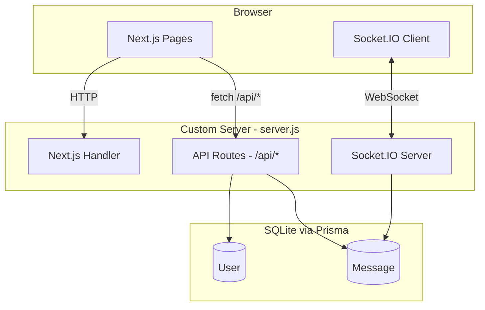

# 1対1 リアルタイムチャットアプリ (Next.js版)

## 概要

LINEのような1対1リアルタイムチャットアプリを Next.js (App Router) + Socket.IO + Prisma + SQLite で構築する。フロントエンドとバックエンドを1つのNext.jsプロジェクトに統合し、ポートフォリオ品質のモダンUIを実現する。

## 技術スタック

- **フレームワーク**: Next.js 14+ (App Router)
- **スタイリング**: Tailwind CSS
- **リアルタイム通信**: Socket.IO (カスタムサーバー経由)
- **ORM**: Prisma
- **データベース**: SQLite (セットアップ不要で手軽)
- **状態管理**: React Context + useState
- **デプロイ先**: Railway

## アーキテクチャ

Next.js のカスタムサーバー (`server.js`) で Express + Socket.IO を統合し、1プロセスでフロントエンドもAPIもWebSocketもすべて提供する。



## プロジェクト構成

```
chat-app/
  server.js                -- カスタムサーバー (Express + Socket.IO + Next.js)
  prisma/
    schema.prisma          -- DB スキーマ定義
  src/
    app/
      layout.jsx           -- ルートレイアウト (Tailwind, フォント)
      page.jsx             -- ログイン画面
      chat/
        page.jsx           -- チャットメイン画面
    components/
      UserList.jsx         -- オンラインユーザー一覧 (サイドバー)
      ChatWindow.jsx       -- メッセージ表示 + 入力エリア
      MessageBubble.jsx    -- 吹き出しコンポーネント
      TypingIndicator.jsx  -- 入力中インジケーター
    lib/
      prisma.js            -- Prisma クライアント (シングルトン)
      socket.js            -- Socket.IO クライアント初期化
    context/
      AuthContext.jsx      -- ログインユーザー情報の管理
      SocketContext.jsx    -- Socket.IO 接続の管理
    app/api/
      login/route.js       -- POST: ユーザー名でログイン
      users/route.js       -- GET: ユーザー一覧取得
      messages/route.js    -- GET: メッセージ履歴取得
  docs/
    DESIGN.md              -- この設計書
  Dockerfile               -- Railway デプロイ用
  .dockerignore            -- node_modules等を除外
```

## データベース設計 (Prisma Schema)

```prisma
model User {
  id        Int       @id @default(autoincrement())
  username  String    @unique
  isOnline  Boolean   @default(false)
  createdAt DateTime  @default(now())
  sent      Message[] @relation("Sender")
  received  Message[] @relation("Receiver")
}

model Message {
  id         Int      @id @default(autoincrement())
  content    String
  read       Boolean  @default(false)
  createdAt  DateTime @default(now())
  senderId   Int
  receiverId Int
  sender     User     @relation("Sender", fields: [senderId], references: [id])
  receiver   User     @relation("Receiver", fields: [receiverId], references: [id])
}
```

## 主要機能

### 1. ログイン画面 (`/`)

- ユーザー名を入力して参加
- 同名ユーザーがオンライン中ならエラー表示
- ログイン後 `/chat` にリダイレクト

### 2. チャット画面 (`/chat`)

- **左サイドバー**: オンラインユーザー一覧 + 最新メッセージプレビュー + 未読バッジ
- **右メインエリア**: 選択したユーザーとの1対1チャット

### 3. メッセージUI

- Discord風の吹き出し (自分: 右/パープルグラデーション、相手: 左/ダークグレー)
- 送信時刻の表示
- 「入力中...」のタイピングインジケーター
- 新着メッセージ受信時の自動スクロール

### 4. リアルタイム機能 (Socket.IO イベント)

- `user:online` (Server -> All) -- ユーザーがオンラインに
- `user:offline` (Server -> All) -- ユーザーがオフラインに
- `message:send` (Client -> Server) -- メッセージ送信
- `message:receive` (Server -> Client) -- メッセージ受信
- `message:read` (Client -> Server) -- 既読通知
- `typing:start` (Client -> Server) -- 入力開始
- `typing:stop` (Client -> Server) -- 入力終了

## UI デザイン方針 -- ダークモード (Discord風)

### カラーパレット

- **背景 (メイン)**: `#1e1e2e` (ダークネイビー)
- **背景 (サイドバー)**: `#2a2a3e` (やや明るいダーク)
- **背景 (メッセージ入力)**: `#252536`
- **アクセント**: `#7c3aed` (パープル / violet-600)
- **アクセント (ホバー)**: `#6d28d9` (violet-700)
- **テキスト (メイン)**: `#e2e8f0` (slate-200)
- **テキスト (サブ)**: `#94a3b8` (slate-400)
- **自分のメッセージ**: `#7c3aed` → `#6d28d9` のグラデーション (白文字)
- **相手のメッセージ**: `#3a3a4e` (グレー, 白文字)
- **オンラインドット**: `#a78bfa` (violet-400)
- **未読バッジ**: `#7c3aed` (violet-600)
- **エラー/通知**: `#ef4444` (red-500)

### デザイン特徴

- Tailwind CSS でダークテーマ統一
- 選択中のユーザーにパープルのグロー効果
- メッセージ吹き出しは角丸、自分は紫グラデーション
- サイドバーの各ユーザーにホバーエフェクト
- レスポンシブ対応 (PC: サイドバー+チャット並列、モバイル: 切り替え表示)
- メッセージ表示時のフェードインアニメーション

## デプロイ (Railway)

Railway はカスタムサーバー + WebSocket に完全対応しており、Git連携で自動デプロイできる。

### 対応事項

- **Dockerfile** を用意し、Railway で Docker ビルドを使用
- **SQLite の永続化**: Railway の Volume マウントを利用して `/data` にDBファイルを配置
- **環境変数**: `DATABASE_URL`, `PORT`, `NODE_ENV=production` を Railway のダッシュボードで設定
- **Prisma Schema**: `DATABASE_URL` を環境変数から読むよう設定済み

### Dockerfile 概要

```dockerfile
FROM node:20-alpine
WORKDIR /app
COPY package*.json ./
RUN npm ci
COPY . .
RUN npx prisma generate
RUN npm run build
EXPOSE 3000
CMD ["node", "server.js"]
```

### デプロイ手順

1. GitHubにリポジトリを作成・Push
2. Railway でプロジェクト作成 -> GitHub リポジトリを接続
3. Railway ダッシュボードで Volume を追加 (`/data` にマウント)
4. 環境変数を設定: `DATABASE_URL=file:/data/chat.db`, `NODE_ENV=production`
5. 自動デプロイが実行され、公開URLが発行される

## ローカル起動方法

```bash
npm install
npx prisma db push
node server.js
# -> http://localhost:3000
```
